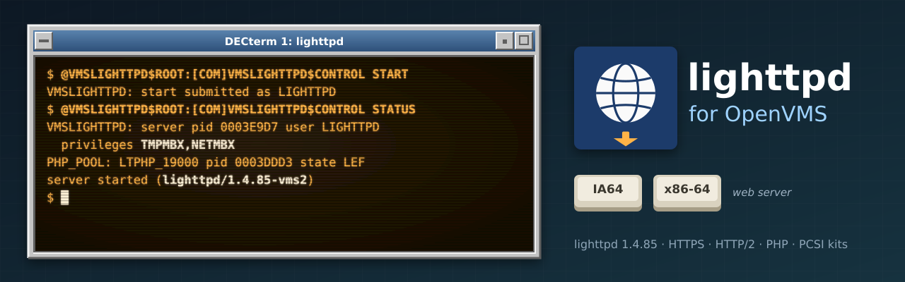

<p align="center">
  
</p>

# vms-lighttpd

A port of [lighttpd](https://www.lighttpd.net/) 1.4 to OpenVMS (x86-64 and IA64): a light,
fast web server, built natively with VSI C, with HTTPS and HTTP/2 through VSI's OpenSSL 3.0
kit (SSL3) and PHP as a pool of persistent FastCGI processes. It is meant as a modern
alternative to VSI's Apache; [phpBB](https://www.phpbb.com/) 3.3 runs on it with PHP 8.1 and
[vms-mariadb](https://github.com/issinoho/vms-mariadb).

**Status:** lighttpd **1.4.85**, kit **LIGHTTPD V1.4-85E2** (preview) for x86-64 and IA64.
Static files, HTTPS (TLS 1.3, and 1.2 when enabled), HTTP/2, PHP over FastCGI, phpBB, and a
service that runs under its own account and drops its privileges after binding: all tested on
both architectures (see `docs/PHASE0.md` ... `docs/PHASE5.md`).

## Installing

Requirements: VSI TCP/IP Services and VSI SSL3 (OpenSSL 3.0); for PHP, a PHP kit with
`PHP_CGI.EXE` under a rooted logical name (default `PHP_ROOT`), readable and executable by the
service account.

```
$ PRODUCT INSTALL LIGHTTPD /SOURCE=dev:[dir]
$ @VMSLIGHTTPD$ROOT:[COM]VMSLIGHTTPD$CONFIGURE        ! once, as SYSTEM
$ @VMSLIGHTTPD$ROOT:[COM]VMSLIGHTTPD$CONTROL START    ! also STOP, RESTART, STATUS, ROTATE
```

`VMSLIGHTTPD$CONFIGURE` creates the service account (default `LIGHTTPD`: batch access only,
`TMPMBX,NETMBX`, quotas for a network server), a data directory (CONF, LOGS, HTDOCS, PHP, TMP),
`LIGHTTPD.CONF` and the PHP pool's `PHP.INI` from templates, and the site settings in
`SYS$MANAGER:VMSLIGHTTPD$CONFIG.COM`. For boot and shutdown add
`@SYS$STARTUP:VMSLIGHTTPD$STARTUP` to `SYSTARTUP_VMS.COM` and
`@SYS$STARTUP:VMSLIGHTTPD$SHUTDOWN` to `SYSHUTDWN.COM`. `PRODUCT REMOVE LIGHTTPD` keeps the
account, data and settings. The kit's `[VMSLIGHTTPD.DOC]README.VMS` has the details.

## Notes for OpenVMS

- **Ports below 1024** need SYSPRV, OPER or BYPASS on VMS. `LIGHTTPD.EXE` is installed with
  `/PRIVILEGED=OPER`; once its listeners are bound it disables every privilege but
  `TMPMBX,NETMBX`, checks that, and stops if anything else is left.
- **Stop and log rotation** use C RTL signals (`LIGHTTPD_SIGNAL.EXE`): SIGTERM for a graceful
  stop, SIGHUP after `ROTATE` has made new log file versions.
- **Configuration paths are UNIX form**, and includes must be absolute.
- **Content should be Stream_LF.** Other record formats (variable, fixed, VFC) are sent by their
  converted bytes up to 32 MB, with a warning to `CONVERT` them.
- **Connections** are limited by the account's FILLM and BYTLM quotas, which the configure
  procedure sets.
- **Behind a reverse proxy** that ends TLS, set `extforward.forwarder` to the proxy's address
  (commented in the template): PHP then sees the client's address and `HTTPS=on`.
- **PHP** runs as `PHP_POOL.COM`'s detached `LTPHP_<port>` processes (`PHP_CGI.EXE -b`);
  lighttpd does not start processes itself (no mod_cgi or FastCGI `bin-path` on VMS).

## How this repository works

It stores only the VMS delta over the signed upstream release, the same way as its siblings
([vms-curl](https://github.com/issinoho/vms-curl), [vms-mariadb](https://github.com/issinoho/vms-mariadb), ...):

- `upstream.conf`: the pinned release, its SHA-256 and signing key (`keys/`)
- `patches/`: 14 changes to upstream files, applied in `patches/series` order, each with its
  VMS reason
- `overlay/`: files we add (config header, build procedure, VMS helpers, service procedures, kit)
- `tools/`: host-side scripts: `prepare.sh`, `build.sh`, `kit.sh`, tests (`test_http.sh`,
  `test_php.sh`, `test_phpbb.py`, `soak.sh`), `installcheck.sh`, and `vms.sh` for the nodes
- `probes/`: small C programs that pin down platform behaviour
- `docs/`: the plan, decisions (`DECISIONS.md`), the porting log and the results of each phase

Home page for all the ports: [openvms.issinoho.com](https://openvms.issinoho.com).

## Artwork

`docs/images/banner.svg` and `docs/images/icon.svg` were made for this project in the style
of classic DECwindows and VT terminals, like those of its sibling ports. The globe mark in
them is our own drawing, not lighttpd's logo.

## Licence

lighttpd is distributed under the revised BSD licence (`COPYING` in the kit).
